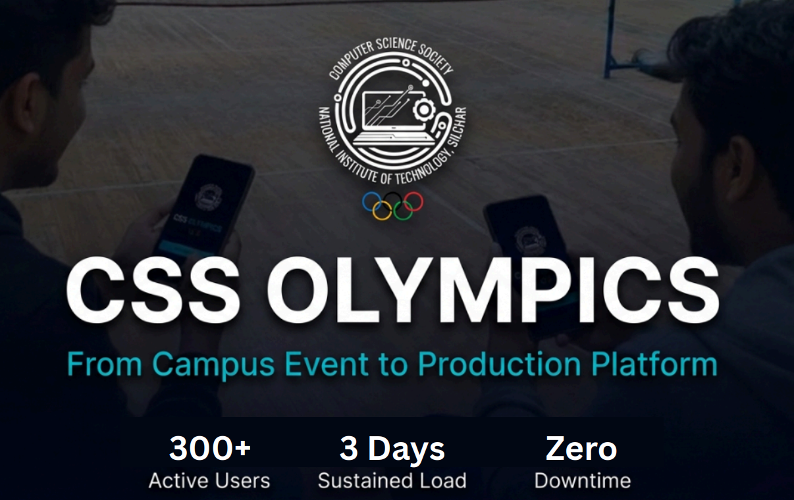
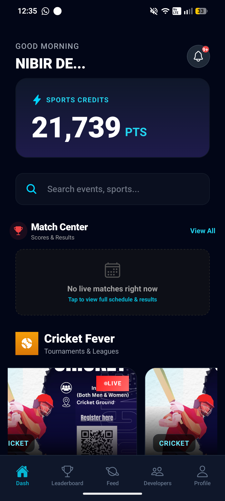
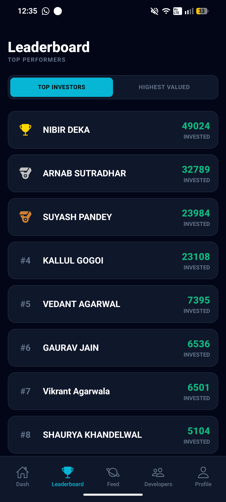
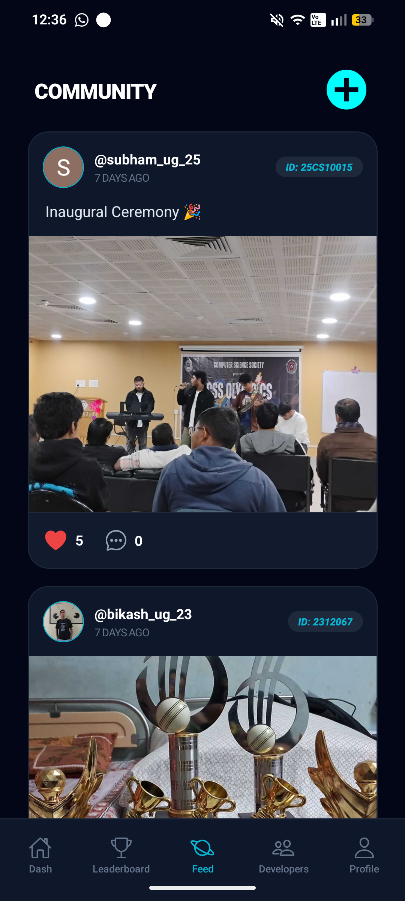
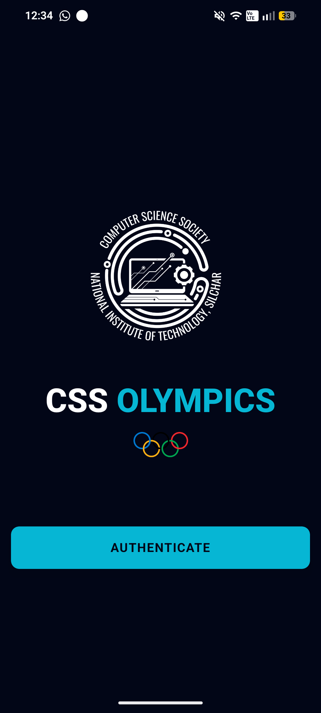
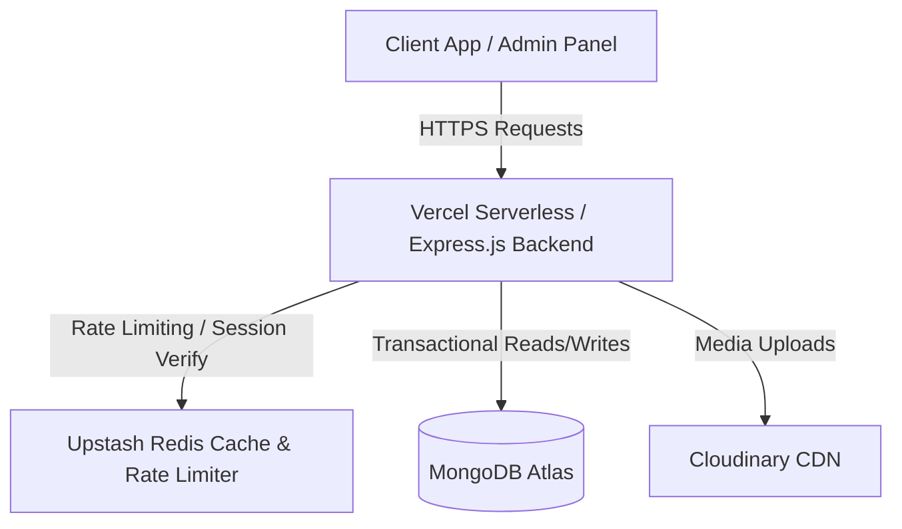

<p align="center">
  
</p>

# CSS-APP: Sports Tournament & Investment Platform

[](https://react.dev)
[](https://nodejs.org)
[](https://mongodb.com)
[](https://upstash.com)
[](https://vitejs.dev)

A comprehensive sports tournament administration, real-time match center, and virtual points-based investment platform designed specifically for the **Computer Science Society (CSS)** at **NIT Silchar**.

> [!IMPORTANT]
> User registration restricts authentication strictly to email addresses containing the `@cse.nits.ac.in` domain to ensure campus-exclusive access.

---

## 📸 Platform Previews

Here is a visual walkthrough of the platform interfaces:

| Home & Match Center | Leaderboard & Stats |
| :---: | :---: |
|  |  |

| Social & Community | Onboarding & Auth |
| :---: | :---: |
|  |  |

---

## 🛠️ System Architecture

The following diagram illustrates how client applications interact with our state-managed, cache-optimized backend:



---

## ✨ Features

- **Tournament & Event Management:** Dynamic creation of solo or group events (e.g. Cricket, Badminton Mixed Doubles) with custom team size configurations.
- **Robust Team Formations:** Atomic registration processes preventing captains and members from signing up for multiple teams in the same event.
- **Match Center:** Real-time administrative controls for scheduling matches, scoring live sets, and finalizing winners.
- **Points Investment Game:** A risk-free virtual points wagering engine where students receive 1,000 startup points to invest on upcoming matches, with automated calculation of payout pots when a match ends.
- **Social Interaction Hub:** Threaded discussions, image posts (via Multer & Cloudinary), and commenting systems to keep the community engaged.
- **Instant System Notifications:** Automated in-app notifications triggered during major events (e.g. match scheduled, live updates, and point payouts).

---

## ⚙️ Tech Stack

* **Frontend:** React, Vite, Tailwind CSS, Shadcn UI Components
* **Backend:** Node.js, Express.js
* **Database:** MongoDB, Mongoose ODM
* **Cache & Rate Limiter:** Upstash Redis
* **Hosting & Media:** Vercel (Frontend), Cloudinary (Image Assets)

---

## 📂 Project Directory Structure

```
├── admin/
│   └── admin-panel/         # React + Vite administrator dashboard
├── backend/
│   ├── src/
│   │   ├── config/          # Redis connection, Mongo configuration, Cron jobs
│   │   ├── controllers/     # Core route handlers (Match, User, Team, Social)
│   │   ├── middleware/      # Rate limits, Google auth guard, file upload config
│   │   ├── models/          # Mongoose Schemas (User, Team, Match, Notification)
│   │   ├── routes/          # API Route mappings
│   │   └── index.js         # Express app entrypoint
└── public/                  # Visual assets, screenshots, and logos
```

---

## 🚀 Getting Started

### Prerequisites
* [Node.js](https://nodejs.org/) (v18+)
* [MongoDB](https://www.mongodb.com/) (Atlas cluster or local database)
* [Upstash Redis](https://upstash.com/) or a local Redis instance

### 1. Setup Backend API
1. Navigate to the backend folder:
   ```bash
   cd backend
   ```
2. Install dependencies:
   ```bash
   npm install
   ```
3. Create a `.env` file in the root of the `backend` folder and populate the following values:
   ```env
   PORT=5000
   MONGO_URI=mongodb+srv://<username>:<password>@cluster.mongodb.net/database_name
   JWT_SECRET=your_jwt_secret_key
   JWT_EXPIRE=7d
   CLOUDINARY_CLOUD_NAME=your_cloudinary_name
   CLOUDINARY_API_KEY=your_cloudinary_key
   CLOUDINARY_API_SECRET=your_cloudinary_secret
   UPSTASH_REDIS_REST_URL=https://<your-instance>.upstash.io
   UPSTASH_REDIS_REST_TOKEN=your_upstash_token
   RATE_LIMIT_MAX_REQUESTS=100
   RATE_LIMIT_WINDOW_MS=900000
   ```
4. Start the server in development mode:
   ```bash
   npm run dev
   ```

### 2. Setup Admin Dashboard
1. Navigate to the admin-panel folder:
   ```bash
   cd admin/admin-panel
   ```
2. Install dependencies:
   ```bash
   npm install
   ```
3. Create a `.env` file in the `admin-panel` folder:
   ```env
   VITE_API_URL=http://localhost:5000/api
   ```
4. Start the local Vite server:
   ```bash
   npm run dev
   ```

---

## 🔒 Key Engineering Highlights

### ⚡ Double-Spend Prevention via Atomic Incs
Points wagers are validated and deducted atomically using MongoDB query-filtering. This avoids concurrency double-spends without using resource-intensive database table locks:
```javascript
const updatedUser = await User.findOneAndUpdate(
  { _id: userId, points: { $gte: pointsInvested } },
  { $inc: { points: -pointsInvested } },
  { new: true, session }
);
```

### 🛡️ ACID Transactions for Match Settlement
When ending a match, the settlement payout loops through winner investments, distributes the losing pot proportionally, increments user balances, and writes audit transactions. The entire process runs inside a **Mongoose Session Transaction** to ensure transactional integrity (all or nothing execution).

### 🚀 Caching & Invalidation Logic
Read-heavy list endpoints (e.g. Events, Posts, Comments) are cached in Upstash Redis using the **Cache-Aside Pattern**. Whenever creation, updates, or deletions occur, the corresponding Redis cache keys are instantly invalidated (`redis.del`) to maintain consistency.
